# iNote

## [Table of Content](#inote)

1.  [Deskripsi Singkat](#deskripsi-singkat)
1.  [Members](#members)
1.  [URL Aplikasi Live](#url-aplikasi-live)
1.  [Penjelasan Arsitektur Cloud yang diterapkan](#penjelasan-arsitektur-cloud-yang-diterapkan)
    1. [Google App Engine](#google-app-engine)
    2. [Cloud SQL](#cloud-sql)
1.  [Petunjuk installasi dan menjalankan di Local Enviroment](#petunjuk-installasi-dan-menjalankan-di-local-enviroment)
    1. [Front-End](#front-end)
    2. [Back-End](#back-end)
1.  [Petunjuk Penggunaan Aplikasi](#petunjuk-penggunaan-aplikasi)

## Deskripsi Singkat

- Nama aplikasi: iNote
  > Mobile app untuk mengatur catatan dan tugas dengan fitur kolaborasi group.

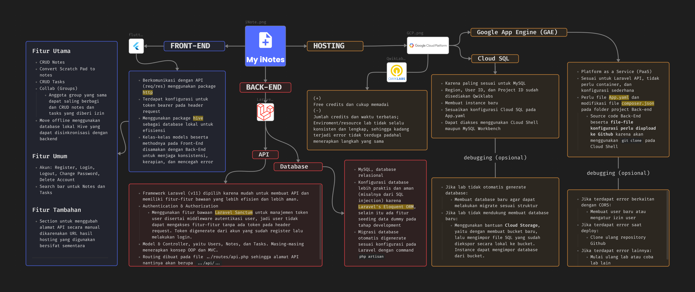

## Members

1. 221110019 Stevie Sawita
1. 221110261 Jonathan
1. 221110311 Vaness Hong
1. 221110724 David Joevincent
1. 221113855 Vincent

## URL Aplikasi Live

- Build APK mobile dapat diinstall pada:

```bash
https://mikroskilacid-my.sharepoint.com/:f:/g/personal/221110019_students_mikroskil_ac_id/EmKn1ZS5roVGhSt-HdYcZ_ABodQuO0SV4HDyhETzlz01hQ?e=6g3JxF
```

- Link API: (berlaku sampai 28 Juni 2025 jam 13.00)

```bash
https://qwiklabs-gcp-00-48e6c8f6f1b1.ue.r.appspot.com/
```

## Penjelasan Arsitektur Cloud yang diterapkan

> Pemanfaatan resource Google Cloud Platform (GCP) pada project ini menggunakan Qwiklabs untuk opsi yang gratis dengan resource yang memadai untuk project. Walaupun tidak konsisten dan perlu konfigurasi tambahan pada beberapa percobaan.

### Google App Engine

- Sesuai untuk host Laravel API.
- Konfigurasi mudah dan sederhana, hanya membutuhkan konfigurasi pada file `App.yaml' pada folder back-end.
- Serverless.
- Dapat mengambil code pada repository GitHub dengan `git clone`.
- Langkah-langkah utama:
  1.  Konfigurasi `App.yaml`
  1.  Clone repository dari GitHub
  1.  `cd <FOLDER_REPOSITORY>`
  1.  `gcloud app deploy`

### Cloud SQL

- Sesuai untuk database relasional seperti MySQL.
- Dalam deployment untuk Laravel, diperlukan import database yang diekspor dari database lokal, seperti pada `helper/inote_database.sql`. Karena tidak dapat menjalankan `php artisan migrate`.
- Langkah-langkah utama:
  1.  Membuat instance baru (sekitar 5 menit).
  1.  Mengimpor database lokal ke bucket Cloud Storage.

## Petunjuk installasi dan menjalankan di Local Enviroment

### Front-End

[Dokumentasi installasi flutter](https://docs.flutter.dev/get-started/install/windows/mobile)

- Dapat dijalankan di emulator maupun web

```bash
flutter pub get
flutter run
```

### Back-End

Requirement:

- PHP (version 8.2 - 8.4)
- xampp (sudah termasuk MySQL) (disarankan v3.3.0)

Tutorial:

- Clone repository
- Install composer

```bash
composer install
```

- Copy file `.env.example` pada file baru `.env` pada root project
- (Optional) Set konfigurasi pada `.env` menyesuaikan MySQL local
- Pastikan sudah start Apache dan MySQL pada xampp
- Jalankan commands berikut

```bash
php artisan key:generate
php artisan migrate
php artisan serve
```

## Petunjuk Penggunaan Aplikasi

### <mark>Fitur untuk mengubah URL API </mark>

> Longpress tombol Refresh & Sync

- 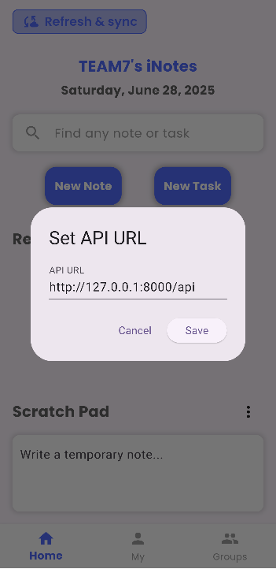

### Authentikasi

- 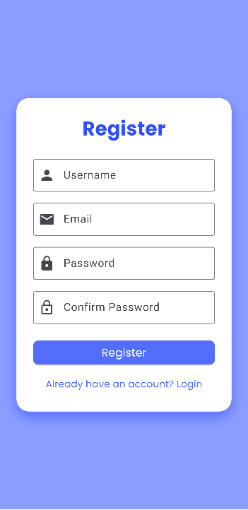
- 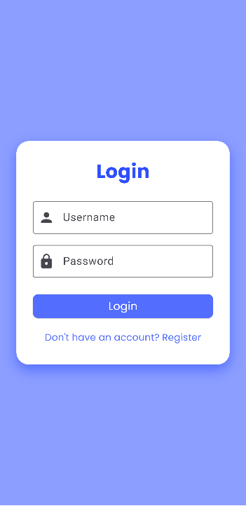
- 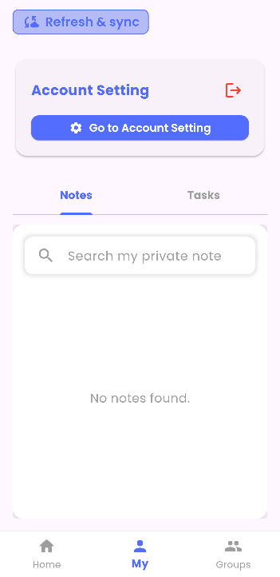

### Tab Home + Add Notes & Task

- 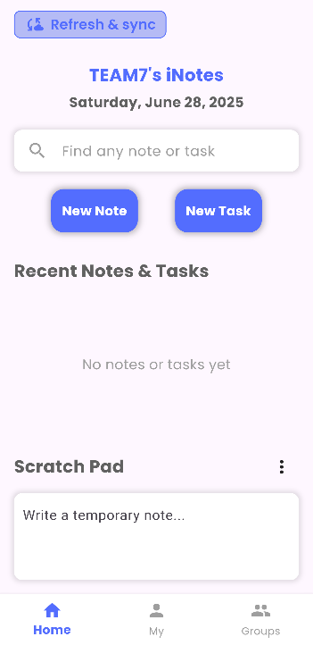

### Tab Private Notes & Tasks

- 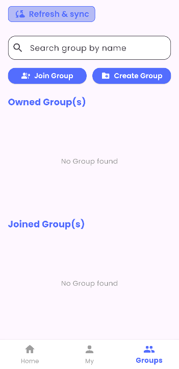

### Account Setting

- 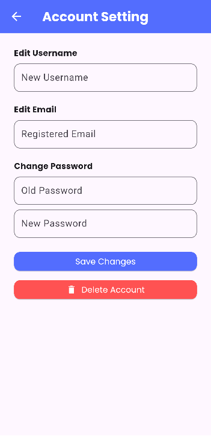

### Group Area

- 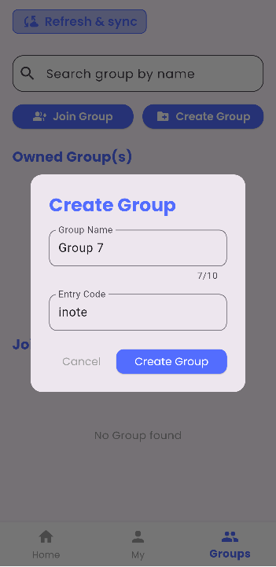
- 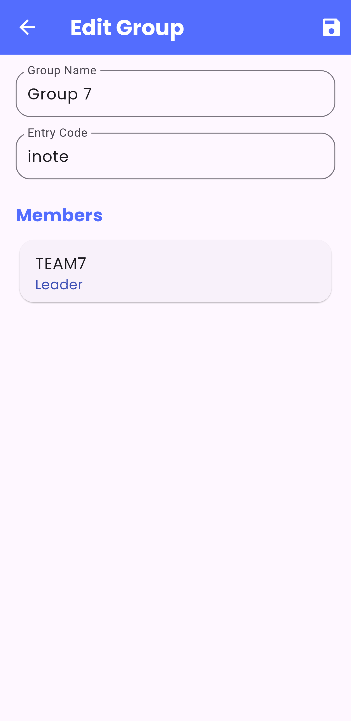
- 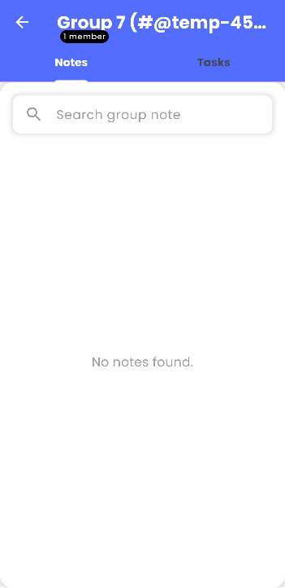
